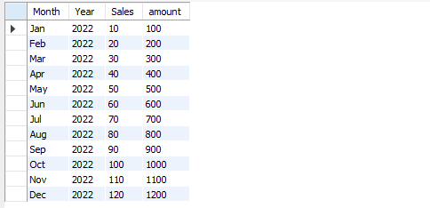
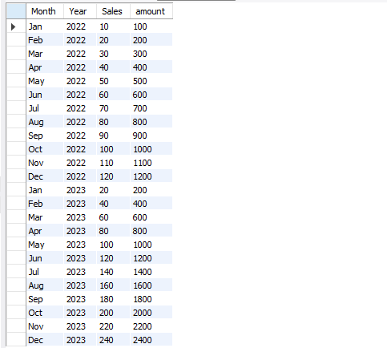
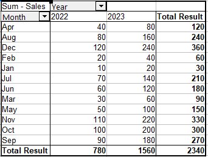
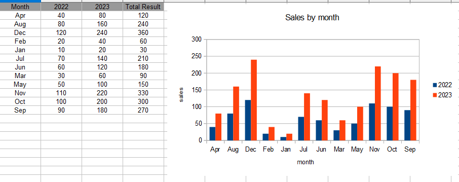

# Overview

In this project I was tasked to combine some sales data from different years, to export the combined sales data and to analyse the data using Open Office

### Combining the data

I was provided sales data in the form of 2 csv files with some sales data from 2022 and 2023. To combine the data I used SQL, importing the data into
MySQL and creating 2 tables.

After importing the two csv files, I had two tables with sales records from 2022 and 2023 as seen below.



To combine the 2 data I ran a Union All query, which resulted in both the 2022 and 2023 data being combined into one list.

```SQL

SELECT * FROM sales2022
UNION ALL
SELECT * FROM sales2023;

```


I exported the combined sales as csv file ready for it to be imported into excel for further analysis

### Using the combined sales data

Using Open Office I imported the combined sales data and created a pivot table that would allow me to extract specific data to use to generate charts and graphs

I created a pivot table with the month as a row field, the year as a column field and the sum of sales a data field



Using this pivot table I created a bar chart that displays the sales by month for each year. We can see how sales in 2023 fared against sales in 2022 by month.





