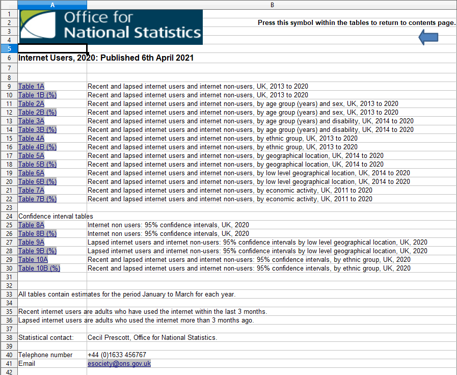
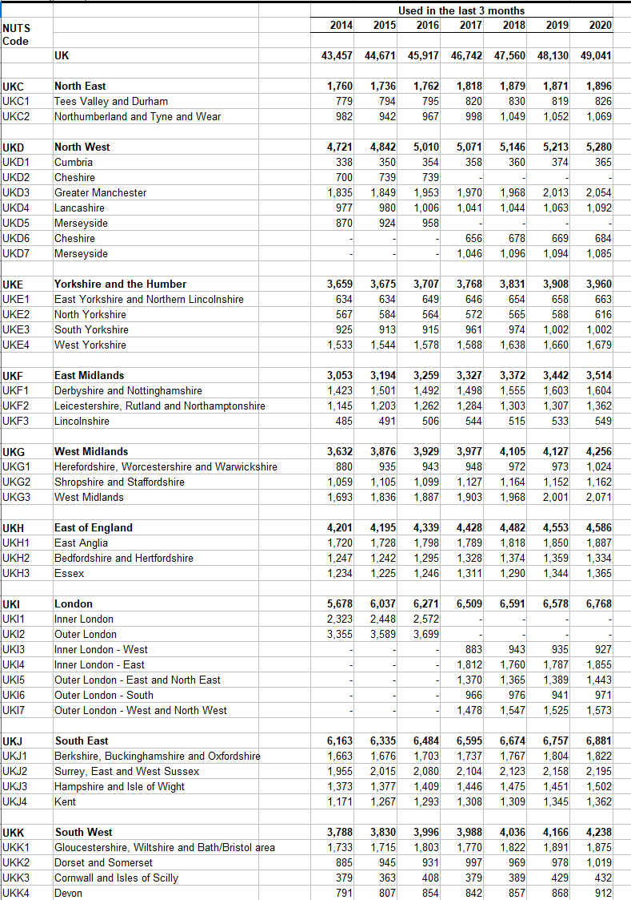
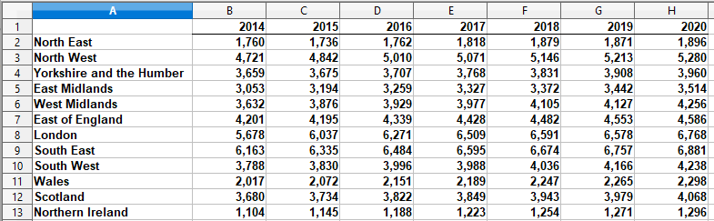
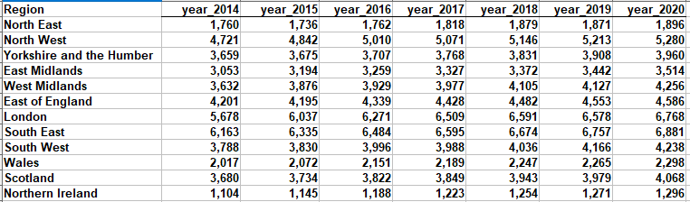

# Overview

In this project I was tasked to obtain a data set about internet usage in the UK broken down by geographic region between 2014 and 2020
and migrate it to a database.

### Sourcing the data

As the task involved spending no money on the data, I chose the Office for National Statistics to source the data.

[Internet users - Office for National Statistics](https://www.ons.gov.uk/businessindustryandtrade/itandinternetindustry/datasets/internetusers)

The dataset contains a lot data on internet usage but the data I needed was about usage broken down by geographic region which was located in table 5A



### Cleaning the data

I took data from the used "Used in the last 3 months columns" from each year and each region. Then I create a new spread sheet and put the data there.



Before the data could be exported there a few things I did to clean the dataset.

1. I removed any blank spaces.
2. I reformatted the columns headings for the years and added a column heading for the regions
3. I made sure column heading were of text data type and any numerical values were integers
4. I centralised the text to make the data look neater

Here are the before and after screen shots

 

Now the dataset is ready for export. I exported the dataset a csv file giving it an appropriate filename. This made it easy to import into MySQL.

### Migrating the data

Firstly, I created a database using the SQL command below

```SQL

CREATE DATABASE internet_usage;

USE internet_usage;

```

Next I used the import table data wizard to import the csv file I exported. This allowed me to create a new table called recent_internetusage.


Once the data was successfully imported, 12 records were created which corresponds to the amount of rows in the spreadsheet. To make sure all the data was imported correctly I ran the following command.

```SQL

SELECT * FROM recent_internetusage;

```

The results from that query were a table with all 12 records as seen below.


