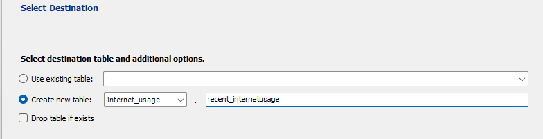
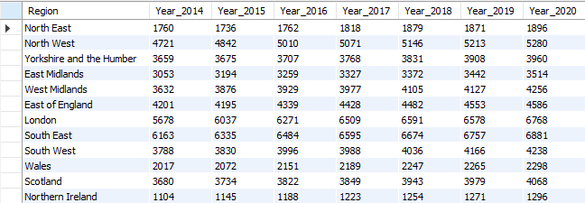
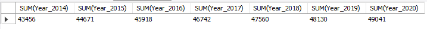

# Overview

In this project I was tasked to obtain a data set about internet usage in the UK broken down by geographic region between 2014 and 2020
and migrate it to a database.

### Sourcing the data

As the task involved spending no money on the data, I chose the Office for National Statistics to source the data.

[Internet users - Office for National Statistics](https://www.ons.gov.uk/businessindustryandtrade/itandinternetindustry/datasets/internetusers)

The dataset contains a lot information on internet usage in the UK but the data I needed was about usage broken down by geographic region which was located in table 5A


### Cleaning the data

I took data from the "Used in the last 3 months" columns from each year and each region. Then I created a new spread sheet and put the data in the new spread sheet.


Before the data could be exported there were a few things I did to clean the dataset.

1. I removed any blank cells.
2. I reformatted the columns headings for the years and added a column heading for the regions
3. I made sure column heading were of text data type and any numerical values were integers
4. I centralised the text to make the data look neater

Below are before and after

 

Now the dataset was ready for export. I exported the dataset as a csv file giving it an appropriate filename. This made it easy to import into MySQL were it would go next.

### Migrating the data

Firstly, I created a database using the SQL command below

```SQL

CREATE DATABASE internet_usage;

USE internet_usage;

```

Next I used the table data import wizard. This allowed me to create a new table called recent_internetusage and import the rows a records.




Once the data was successfully imported, 12 records were created which corresponded to the amount of rows in the spreadsheet. To make sure all the data was imported correctly I ran the following command.

```SQL

SELECT * FROM recent_internetusage;

```

The results from that query were a table with all 12 records as seen below.



Below is a query that can return the region with most users in the year 2014

```SQL
SELECT Region, Year_2014 FROM recent_internetusage 
WHERE Year_2014 = (SELECT MAX(Year_2014) FROM recent_internetusage);
```


By running the query below we can return the sum of users in each of the years
```SQL
SELECT SUM(Year_2014), SUM(Year_2015), SUM(Year_2016), SUM(Year_2017), SUM(Year_2018), SUM(Year_2019), SUM(Year_2020)
FROM recent_internetusage;
```


We can see from the result internet usage has increased each year
